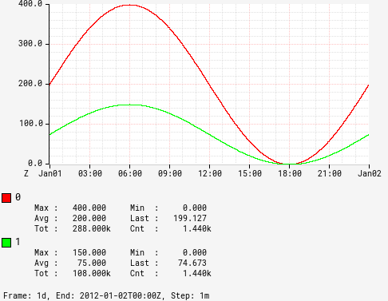

# byblos

Byblos is a generator of [RRDtool](https://oss.oetiker.ch/rrdtool/)-like graphs for [Prometheus](https://prometheus.io/).

## License

This project is distributed under the Apache 2.0 License.

A large part of the code comes from [the Atlas project](https://github.com/Netflix/atlas) (a time series database from Netflix), also distributed under the Apache 2.0 License.
Code has been ported from Scala to Java, and adapted to work with Prometheus.