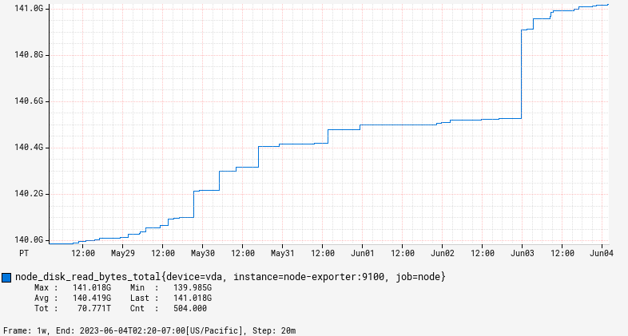

# byblos

[](https://github.com/pvcnt/byblos/actions/workflows/build.yaml)

Byblos is a generator of [RRDtool](https://oss.oetiker.ch/rrdtool/)-like graphs for [Prometheus](https://prometheus.io/).

## Usage

Byblos exposes a GET endpoint that takes as input a Prometheus expression and renders it as an image.

For example, let us use the public Prometheus instance hosted at demo.promlabs.com.
Given [the following Prometheus expression](https://demo.promlabs.com/graph?g0.expr=node_disk_read_bytes_total&g0.tab=0&g0.range_input=1w):
```
node_disk_read_bytes_total
```

the following request will generate an image for it:
```
https://byblos.fly.dev/api/v1/graph?q=node_disk_read_bytes_total&s=now-1w
```

which will render something like:



## Run locally

You can start the Docker image directly:
```bash
docker run -p 8080:8080 -ghcr.io/pvcnt/byblos/byblos
```

If you need to customise the configuration, you can pass an additional configuration file as an extra argument, e.g.:
```bash
docker run -p 8080:8080 -v $PWD/custom.conf:/custom.conf ghcr.io/pvcnt/byblos/byblos /custom.conf
```

This file can be used for example to customise the Prometheus instance to connect to:
```
byblos.eval.db {
    endpoint = "https://my.prometheus.instance"
}
```

## License

This project is distributed under the Apache 2.0 License.

A large part of the code comes from [the Atlas project](https://github.com/Netflix/atlas) (a time series database from Netflix), also distributed under the Apache 2.0 License.
Code has been ported from Scala to Java, and adapted to work with Prometheus.