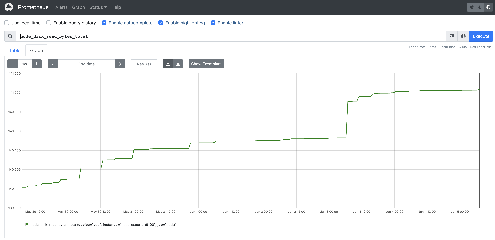

# Getting started

This page explains how to quickly start using Byblos.

## Use demo instance

The simplest way to start playing around with Byblos is to use our demo instance, available at [byblos.fly.dev](https://byblos.fly.dev).
The latter is configured to use the demo Prometheus instance available at [demo.promlabs.com](https://demo.promlabs.com).

For example, let us consider the following prometheus expression, evaluated over the past week:

```
node_disk_read_bytes_total
```

It can be visualised in [the Prometheus console](https://demo.promlabs.com/graph?g0.expr=node_disk_read_bytes_total&g0.tab=0&g0.range_input=1w):



A PNG graph for this query can be visualised using Byblos, using the following request:

```
https://byblos.fly.dev/api/v1/graph?q=node_disk_read_bytes_total&s=now-1w
```

which will render something like:


## Run with Docker

A Docker image is published to GitHub's registry at every commit.
It can be started locally using the following command:

```bash
docker run -p 8080:8080 -ghcr.io/pvcnt/byblos/byblos
```

By default, it is configured to use the demo Prometheus instance available at https://demo.promlabs.com

Similarly to above, the following request can be used to generate a sample PNG graph with Byblos:

```
https://localhost:8080/api/v1/graph?q=node_disk_read_bytes_total&s=now-1w
```

Several [configuration parameters](admin/configuration.md) may be overriden in order to customise the behaviour of Byblos.
You may provide one or several config files as additional arguments, that will take precedence over the default configuration:

```bash
docker run -p 8080:8080 -v $PWD/custom.conf:/custom.conf ghcr.io/pvcnt/byblos/byblos /custom.conf
```