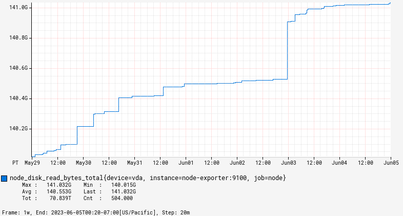

# Byblos

Byblos renders [Prometheus](https://prometheus.io/) queries as PNG graphs.

While most dashboarding tools offer dynamic graphs (where one can easily point and click), Byblos generates PNG images.
Compared to dynamic graphs, those PNG graphs can be easily embedded anywhere where images can be, such as in emails, websites or on-call systems.
They can also easily be downloaded, shared (e.g., via Slack or email), and saved in order to work around data expiration.

